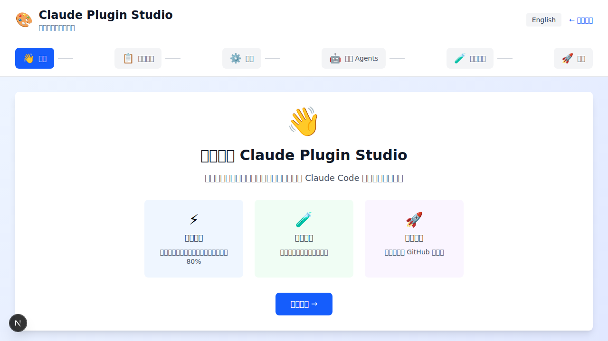
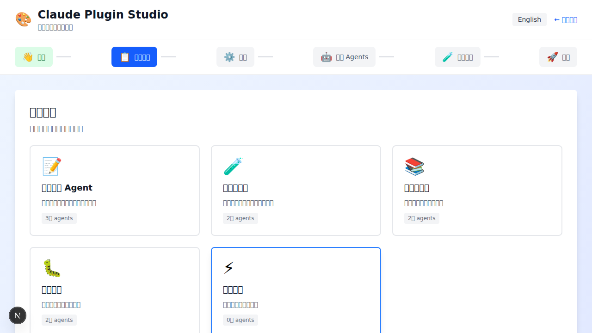
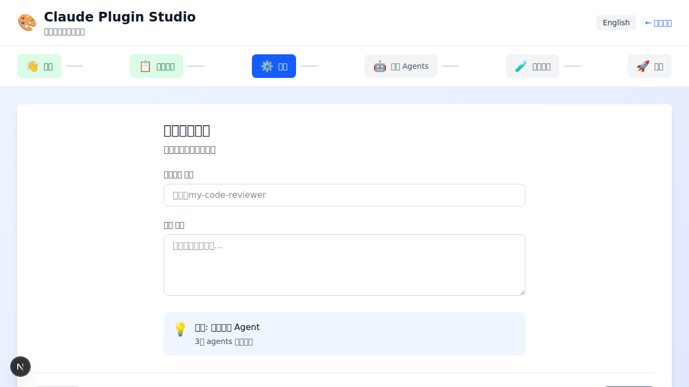
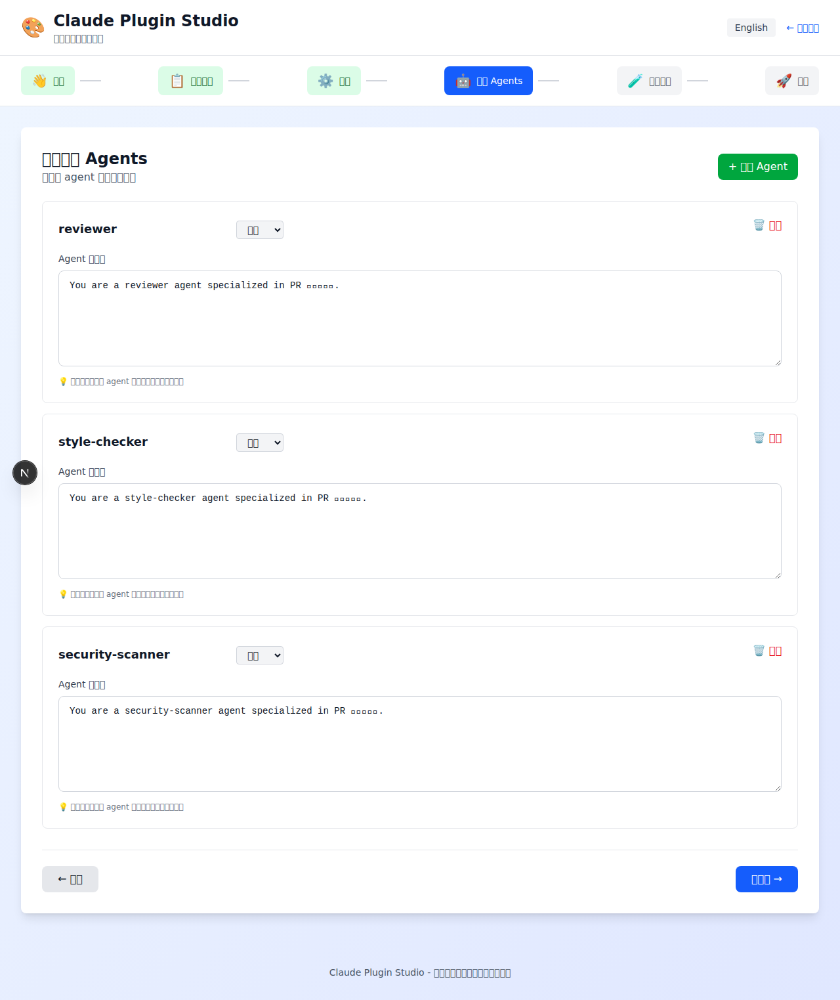
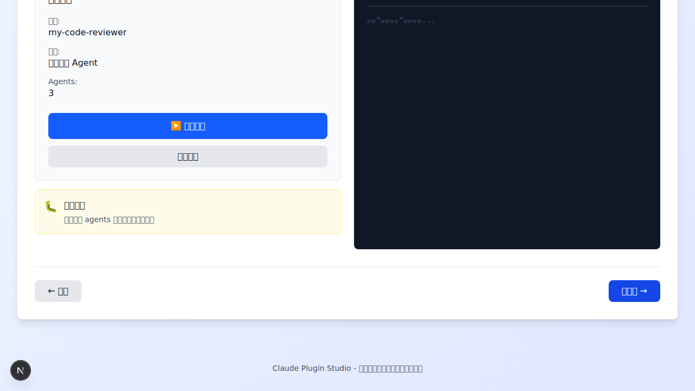
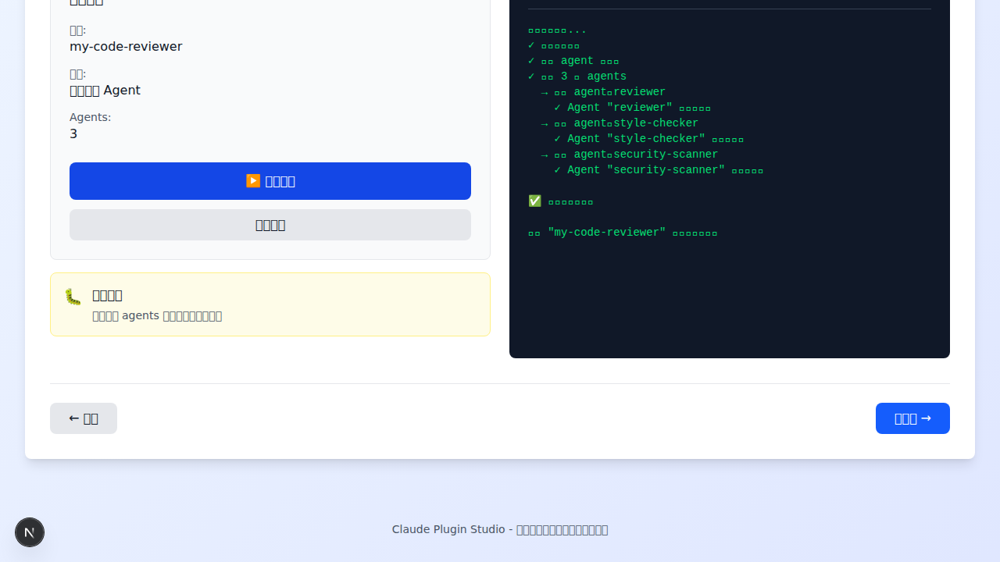
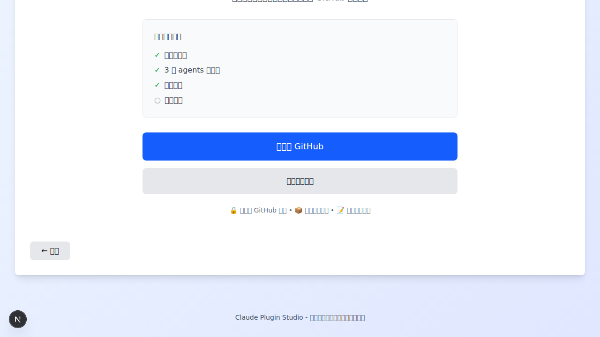

# Claude Plugin Studio 原型截图 - 中文版本

安装中文字体后重新截取的高质量截图，所有中文文本正常显示。

## 安装的中文字体

- fonts-noto-cjk (Noto CJK 字体)
- fonts-wqy-zenhei (文泉驿正黑)
- fonts-wqy-microhei (文泉驿微米黑)

## 截图列表

### 1. 欢迎页面（中文默认）



**展示内容：**
- 标题：欢迎使用 Claude Plugin Studio
- 副标题：可视化插件开发工具
- 三大特性卡片：
  - ⚡ 快速开发：使用模板和可视化工具，开发速度提升 80%
  - 🧪 内置测试：部署前测试和调试您的插件
  - 🚀 一键部署：一键部署到 GitHub 和市场
- 按钮：开始使用 →

### 2. 模板选择页面



**展示内容：**
- 标题：选择模板
- 副标题：从预建模板开始或从头创建
- 五个模板卡片：
  - 📝 代码审查 Agent - 自动化代码审查，检查最佳实践（3个 agents）
  - 🧪 测试生成器 - 自动生成单元测试和集成测试（2个 agents）
  - 📚 文档编写器 - 从代码生成全面的文档（2个 agents）
  - 🐛 调试助手 - 交互式调试和错误分析（2个 agents）
  - ⚡ 从头开始 - 从零构建自定义插件（0个 agents）

### 3. 配置插件页面



**展示内容：**
- 标题：配置您的插件
- 副标题：关于您插件的基本信息
- 表单字段：
  - 插件名称（必填）：输入框提示 "例如：my-code-reviewer"
  - 描述（必填）：多行文本框提示 "描述您的插件功能..."
- 模板信息卡：
  - 💡 模板：代码审查 Agent
  - 3个 agents 已预配置

### 4. 设计 Agents 页面



**展示内容：**
- 标题：设计您的 Agents
- 副标题：自定义 agent 提示词和行为
- 添加 Agent 按钮
- 三个 Agent 配置卡：
  - reviewer（辅助）
  - style-checker（辅助）
  - security-scanner（辅助）
- 每个 Agent 包含：
  - 名称输入框
  - 类型下拉选择（主要/辅助/验证器）
  - Agent 提示词编辑框
  - 删除按钮
  - 💡 提示：明确说明 agent 的角色、职责和预期行为

### 5. 测试调试页面（初始状态）



**展示内容：**
- 标题：测试和调试您的插件
- 副标题：在部署前运行测试和调试插件
- 插件摘要面板：
  - 名称：my-code-reviewer
  - 模板：代码审查 Agent
  - Agents：3
- 控制按钮：
  - ▶️ 运行测试
  - 清空输出
- 调试模式卡：
  - 🐛 调试模式
  - 实时查看 agents 执行，包含详细日志
- 控制台输出区域：
  - 黑色背景
  - 绿色文字
  - 提示："点击'运行测试'查看输出..."

### 6. 测试调试页面（测试完成）



**展示内容：**
- 完整的测试执行日志（中文）：
  ```
  开始测试执行...
  ✓ 加载插件配置
  ✓ 验证 agent 提示词
  ✓ 找到 3 个 agents
  
  → 测试 agent：reviewer
  ✓ Agent "reviewer" 初始化成功
  
  → 测试 agent：style-checker
  ✓ Agent "style-checker" 初始化成功
  
  → 测试 agent：security-scanner
  ✓ Agent "security-scanner" 初始化成功
  
  ✅ 所有测试通过！
  插件 "my-code-reviewer" 已准备好部署。
  ```
- 所有文本使用中文显示
- 绿色文字在黑色终端风格背景上
- 步骤级别的可视化进度

### 7. 部署页面



**展示内容：**
- 标题：准备部署！
- 副标题：您的插件已配置和测试完成。部署到 GitHub 和市场。
- 部署检查清单：
  - ✓ 插件已配置
  - ✓ 3 个 agents 已定义
  - ✓ 测试通过
  - ○ 准备部署
- 操作按钮：
  - 部署到 GitHub
  - 下载插件文件
- 特性说明：
  - 🔒 安全的 GitHub 集成
  - 📦 自动版本控制
  - 📝 自动生成文档

## 技术细节

### 字体安装命令
```bash
sudo apt-get update
sudo apt-get install -y fonts-noto-cjk fonts-wqy-zenhei fonts-wqy-microhei
fc-cache -fv
```

### 截图参数
- 浏览器：Playwright (Chromium)
- 分辨率：1280x720（viewport）
- 字体渲染：已启用 CJK 字体支持
- 格式：PNG
- 质量：无损

## 对比

### 之前的问题
- 中文显示为方框 (□□□□)
- 系统缺少中文字体支持
- 无法正确渲染汉字

### 修复后
- ✅ 所有中文文本正常显示
- ✅ 字体清晰可读
- ✅ 支持简体中文、繁体中文
- ✅ 标点符号正确显示

## 使用说明

1. 安装中文字体（如上命令）
2. 启动开发服务器：`yarn dev`
3. 访问：http://localhost:3000/studio
4. 默认语言为中文
5. 点击右上角 "English" 可切换到英文

## 文件位置

所有截图保存在：`docs/screenshots/`

- `01-welcome-zh.png` - 欢迎页面
- `02-templates-zh.png` - 模板选择
- `03-configure-zh.png` - 配置页面
- `04-agents-zh.png` - Agents 设计
- `05-test-initial-zh.png` - 测试初始状态
- `06-test-complete-zh.png` - 测试完成
- `07-deploy-zh.png` - 部署页面

## 更新日期

2025-11-02

## 相关文件

- `app/studio/StudioClient.tsx` - 主要组件
- `app/studio/i18n.ts` - 国际化配置
- `docs/STUDIO_PROTOTYPE_GUIDE.md` - 原型使用指南
- `docs/STUDIO_SCREENSHOTS.md` - 旧版截图（中文显示异常）
